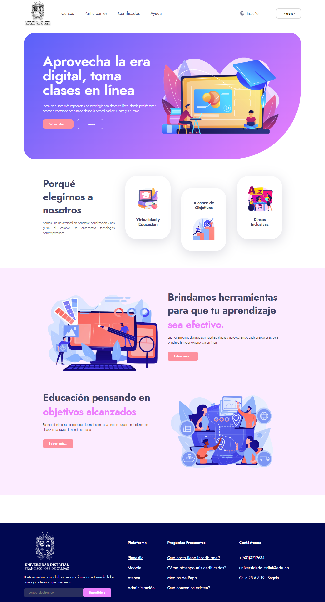

<h1>Taller 9: Angie Useche</h1>
<h2>Información</h2>

Curso: Full Stack Básico - Grupo 1

Profesor: Cristian Patiño

<h2>Punto 1: Link de Figma</h2>
<a href="https://www.figma.com/file/CEDajpsbBifte5A7m1eI2H/Ejericio-Mockup?type=design&node-id=0%3A1&t=SqZ54X7TyiXpCW6U-1">Link de Figma</a>
 
<a href="https://angieuseche.github.io/Taller-9-Full-Stack/">Link de Página Web</a>

<h2>Punto 2: Imagen código HTML</h2>

<h2>Punto 3: Imagen CSS</h2>

<h2>Punto 4: Imagen Titulos</h2>

<h2>Punto 5: Imagen Textos</h2>

<h2>Punto 6: Imagen Enlaces</h2>

El ultimo enlace redirecciona al menú

<h2>Punto 7: Navegacion</h2>

El botón Inicio redirecciona al menú

